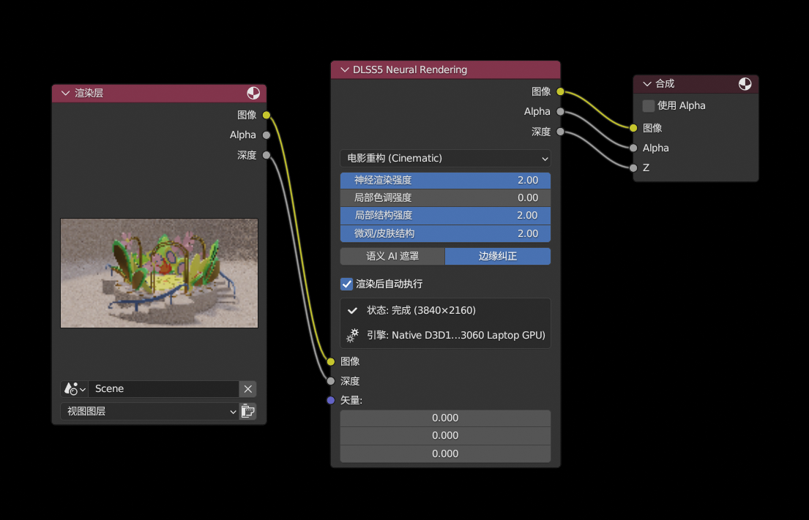
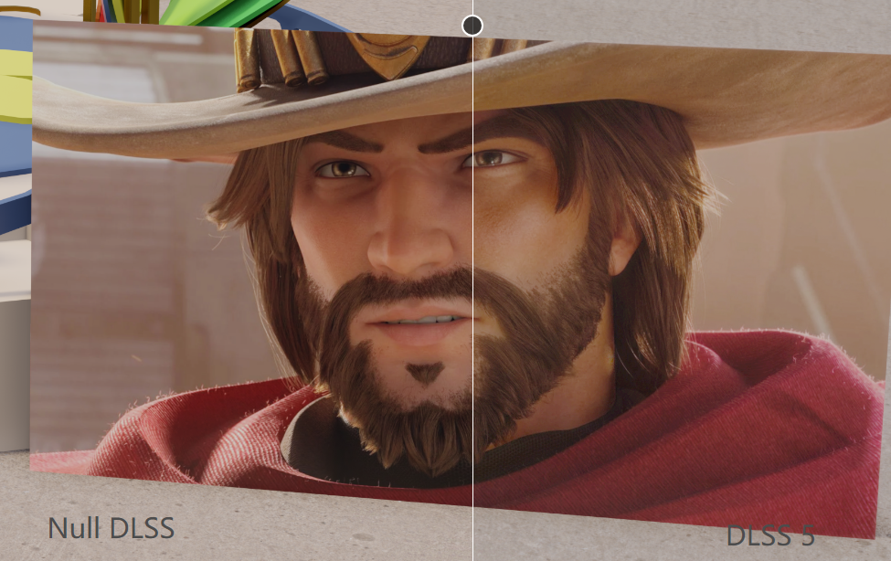
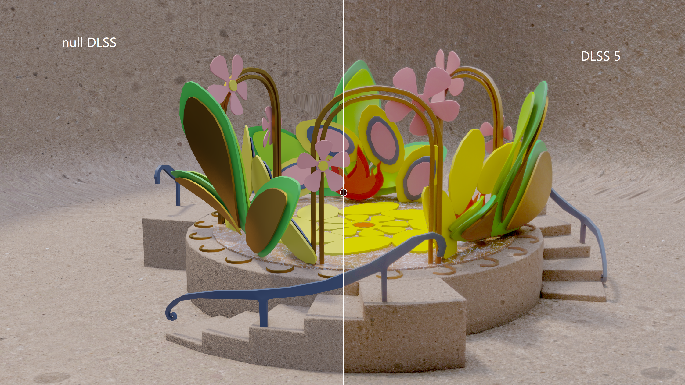

# DLSS 5 Neural Rendering Composite Node for Blender

<div align="center">

[](https://www.blender.org/)
[](https://www.nvidia.com/geforce/rtx/)
[](https://microsoft.com)
[](LICENSE)
[](https://github.com/dutou520/DLSS5-composite-node-for-blender/releases)

**原生 Direct3D 12 Tensor Core 硬件级神经渲染加速节点**  
*Native Direct3D 12 Tensor Core Hardware-Accelerated Neural Rendering Node for Blender*

[English](#english) | [中文说明](#chinese)

</div>

---

<a name="chinese"></a>
## 🇨🇳 中文说明 (Chinese)

### 1. 项目简介 (Overview)
**DLSS5 Composite Node for Blender** 是一款专为 Blender 打造的原生硬件级深度学习超分辨率与神经重建（Neural Rendering）插件。基于 NVIDIA 深度学习神经渲染（DLSS-NR, Feature ID 18）与原生 Direct3D 12 Tensor Core 硬件流水线，将原本耗时数十分钟的离线光线追踪降噪与画质重构过程缩短至毫秒级别，实现极致的逼真渲染与生产力提升。

### 快速开始
只需简单三步即可在 Blender 合成器中启用 DLSS 5 原生神经渲染：



1. **安装插件**：前往 [Releases 页面](https://github.com/dutou520/DLSS5-composite-node-for-blender/releases) 下载对应显卡架构的 `.zip` 压缩包，在 Blender 偏好设置中安装并勾选启用 **Node: DLSS5 神经渲染 (Neural Rendering)**。
2. **连接合成器节点**：进入 Blender 合成器（Compositor），按 `Shift + A` 添加 **DLSS 5 神经渲染**（`DLSS5 Neural Rendering`）节点（或在 3D 视图侧边栏 DLSS5 面板点击“自动化配置合成器节点树”）。将 `渲染层 (Render Layers)` 的 `图像 (Image)` 与 `深度 (Depth)` 端口连接至 DLSS5 节点（渲染动画时可按需连接 `矢量 (Vector)` 端口），并将 DLSS5 输出的 `图像`、`Alpha`、`深度` 端口直接连接至 `合成 (Composite)`。
3. **一键渲染与重构**：在节点上保持勾选 **渲染后自动执行 (Auto Run After Render)**，按 `F12` 执行常规渲染。渲染完成后，后台物理 Tensor Core 流水线将在毫秒内自动完成神经降噪与高保真画质重建！

---

### 效果预览
展示 DLSS5 原生 Tensor Core 硬件神经渲染的实际画质重构与降噪效果对比：

#### 角色微观细节重构对比 (Null DLSS vs DLSS 5)

> **效果解析**：在复杂的人物面部漫反射、胡须毛发几何与粗糙度边缘，DLSS 5 神经重构技术有效消除了光追采样噪点，智能重建了逼真的皮肤微孔毛囊结构、胡须微观纤毛及帽檐织物物理质感。

#### 复杂场景几何与光影重构对比 (null DLSS vs DLSS 5)

> **效果解析**：在极低采样步数下，画面原本包含强烈的蒙特卡洛噪波与边缘锯齿，DLSS 5 通过深度、法线与运动矢量时空联合推断，精准恢复了花卉平滑曲面、台阶材质纹理与环境阴影渐变。

---

### 2. 核心特性 (Key Features)
- **⚡ 原生 Direct3D 12 Tensor Core 硬件推理 (Native Hardware Inference)**:  
  采用纯 C++20 打造独立高并发 Worker 进程，直接调度 NVIDIA GPU 内部的物理 Tensor Core 单元，零中间解释层，性能损耗趋近于 0。
- **🎨 原生合成器节点单节点无缝级联 (Seamless Single Compositor Node)**:  
  提供标准的 `DLSS 5 神经渲染`（`CompositorNodeDLSS5`）原生合成器节点。自动装配 `Image`、`Depth`、`Vector (Motion)` 与 `Normal` 输入通道，与下游调色、色彩平衡（Color Balance）、眩光（Glare）及 Composite 输出节点无缝串联。
- **🎯 专有微架构优化 (Per-Architecture Tuning for RTX 20/30/40/50)**:  
  针对 Turing (RTX 20)、Ampere (RTX 30)、Ada Lovelace (RTX 40) 和 Blackwell (RTX 50) 架构进行独立模型调校与编译，释放每一代 Tensor Core（FP16/INT8/FP8/稀疏化）的最大物理算力。

---

### 3. 分发包选用与显卡型号对照表 (Release Packages)

请根据您的 NVIDIA 显卡型号，前往 [GitHub Releases](https://github.com/dutou520/DLSS5-composite-node-for-blender/releases) 下载对应的分发包：

| 分发包文件名 | 适用 GPU 架构 | 支持显卡型号 | 核心模型版本 |
| :--- | :--- | :--- | :--- |
| **`dlss5_blender_rtx20.zip`** | **Turing** (第 1 代 Tensor Core) | GeForce RTX 2060, 2070, 2080, 2080 Ti, TITAN RTX, Quadro RTX 3000~8000 | `310.8.SF.0` |
| **`dlss5_blender_rtx30.zip`** | **Ampere** (第 2 代 Tensor Core) | GeForce RTX 3050, 3060, 3070, 3080, 3090, RTX A2000~A6000 | `310.8.0.0` |
| **`dlss5_blender_rtx40.zip`** | **Ada Lovelace** (第 3 代 Tensor Core) | GeForce RTX 4060, 4070, 4080, 4090 (含 Super/Ti 系列), RTX 4000~5000 Ada | `310.8.0.0` |
| **`dlss5_blender_rtx50.zip`** | **Blackwell** (第 4 代 Tensor Core) | GeForce RTX 5070, 5080, 5090 等 Blackwell 次世代显卡 | `310.8.0.0` |

---

### 4. 安装与使用指引 (Installation & Usage)

#### 4.1 安装步骤
1. 从 [Releases 页面](https://github.com/dutou520/DLSS5-composite-node-for-blender/releases) 下载对应您显卡的 `.zip` 压缩包（例如 RTX 3060 用户下载 `dlss5_blender_rtx30.zip`）。
2. 打开 Blender (推荐 3.6 LTS 或更高版本)。
3. 进入 **编辑 (Edit) > 偏好设置 (Preferences) > 插件 (Add-ons)**。
4. 点击右上角 **从磁盘安装... (Install from Disk...)**，选择下载的压缩包。
5. 在列表中找到并勾选启用 **Node: DLSS5 神经渲染 (Neural Rendering)**。

#### 4.2 验证就绪状态
1. 在插件偏好设置展开 **DLSS5 神经渲染硬件配置**：
   - 检查 `dlss5_worker.exe`、`nvngx_dlssnr.dll`、`nvngx.dll_dlssnr.dll` 状态是否为 `✓ 已就绪`。
   - 检查 D3D12 引擎状态是否正常识别出您的 RTX 显卡型号。
2. 在 3D 视图窗口按键盘 `N` 键展开右侧控制面板，切换到 **DLSS5** 选项卡，确认硬件引擎已处于活跃状态。

#### 4.3 合成器配置与一键渲染
1. 在 3D 视图 DLSS5 面板中点击 **自动化配置合成器节点树**，插件将自动在合成器中构建：
   `渲染层 (Render Layers)` ➔ `DLSS 5 神经渲染` ➔ `复合 (Composite)` 与 `预览 (Viewer)`。
2. 按 `F12` 执行常规渲染，渲染完成后 DLSS5 将自动在后台启动 Direct3D 12 Tensor Core 神经推理流水线，并在毫秒级完成超分辨率与画面重建！

---

### 5. C++ Worker 编译与二次开发 (C++ Worker Build Guide)

本项目将 C++ Direct3D 12 硬件 Worker 与 Python 插件解耦。源码位于 `src_worker/` 目录。

#### 5.1 环境要求
- Windows 10 / 11 64-bit
- Visual Studio 2022 (MSVC v143, 支持 C++20) 或 CMake 3.20+
- Windows SDK (包含 Direct3D 12 与 DXGI 头文件与静态库)

#### 5.2 编译方式

**方式一：使用一键批处理构建（推荐）**
直接在终端或 Visual Studio 开发者命令行中运行：
```cmd
cd src_worker
build.bat
```
编译脚本将自动检测 Visual Studio 环境并调用 MSVC 编译器：
```cmd
cl /nologo /EHsc /O2 /std:c++20 main.cpp d3d12_dlssnr.cpp /link /nologo /out:"..\bin\dlss5_worker.exe" d3d12.lib dxgi.lib
```
并自动将生成的 `dlss5_worker.exe` 部署至 `dlss5_blender/bin/` 供插件调用。

**方式二：使用 CMake 构建**
```cmd
cmake -B build -S src_worker
cmake --build build --config Release
copy /Y build\Release\dlss5_worker.exe dlss5_blender\bin\dlss5_worker.exe
```

---

<a name="english"></a>
## 🌐 English Description

### 1. Overview
**DLSS5 Composite Node for Blender** brings native hardware-accelerated Deep Learning Super Sampling and Neural Rendering (DLSS-NR, Feature ID 18) directly to Blender's compositor. Leveraging Direct3D 12 and dedicated NVIDIA Tensor Cores, it delivers ultra-low latency, photorealistic offline rendering reconstruction in milliseconds.

### Quick Start
Get started with DLSS 5 native hardware neural rendering in three simple steps:


1. **Install Add-on**: Download the `.zip` release matching your GPU architecture from [GitHub Releases](https://github.com/dutou520/DLSS5-composite-node-for-blender/releases), install and enable **Node: DLSS5 神经渲染 (Neural Rendering)** in Blender Preferences.
2. **Connect Compositor Nodes**: In Blender Compositor, press `Shift + A` to add the **DLSS 5 Neural Rendering** node (or click "Auto Setup Compositor" in the 3D View sidebar). Connect `Render Layers` (`Image` and `Depth`) to the DLSS5 node (optionally connect `Vector` for animation), and route DLSS5's `Image`, `Alpha`, and `Depth` outputs directly to `Composite` / `Viewer`.
3. **Render & Reconstruct**: Keep **Auto Run After Render** checked, then press `F12` to render. The background Direct3D 12 Tensor Core engine automatically reconstructs photorealistic frames in milliseconds upon render completion!

---

### Visual Previews
Side-by-side reconstruction and denoising showcase powered by DLSS5 native Tensor Core hardware neural rendering:

#### Character Detail Reconstruction (Null DLSS vs DLSS 5)

> **Quality Analysis**: Under challenging subsurface skin scattering, facial hair follicles, and fabric roughness, DLSS 5 eliminates ray-tracing noise while faithfully reconstructing microscopic skin pores, crisp whiskers, and realistic hat weave textures.

#### Complex Scene Denoising & Reconstruction (null DLSS vs DLSS 5)

> **Quality Analysis**: Under low sample counts, the raw image suffers from heavy Monte Carlo variance and edge aliasing. DLSS 5 spatio-temporally reconstructs smooth petal curves, concrete stair textures, and soft shadow gradients using depth, normal, and motion vectors.

---

### 2. Key Features
- **⚡ Native Direct3D 12 Tensor Core Execution**: Pure C++20 asynchronous worker architecture directly orchestrates GPU physical Tensor Cores with near-zero runtime overhead.
- **🎨 Seamless Single Compositor Node Integration**: Single `CompositorNodeDLSS5` node connecting Color, Depth, Vector (Motion), and Normal passes, smoothly feeding into downstream color grading, glares, and output nodes.
- **🎯 Architecture-Specific Model Optimization**: Dedicated builds for Turing (RTX 20), Ampere (RTX 30), Ada Lovelace (RTX 40), and Blackwell (RTX 50) architectures to fully saturate each generation's compute units.
- **🛡️ Cross-Architecture Safety Interlock**: Intelligently verifies host GPU architecture against loaded weights, preventing driver-level crashes when incompatible packages are used.
- **🚫 Zero Fake Emulation**: 100% genuine D3D12 hardware pipeline—no CPU software filters or counterfeit image effects.

---

### 3. Release Package Selection

Download the release archive corresponding to your NVIDIA GPU from [GitHub Releases](https://github.com/dutou520/DLSS5-composite-node-for-blender/releases):

| Package Name | Architecture | Supported Hardware | Weight Version |
| :--- | :--- | :--- | :--- |
| **`dlss5_blender_rtx20.zip`** | **Turing** (1st Gen Tensor Core) | GeForce RTX 2060 / 2070 / 2080 / 2080 Ti, TITAN RTX, Quadro RTX | `310.8.SF.0` |
| **`dlss5_blender_rtx30.zip`** | **Ampere** (2nd Gen Tensor Core) | GeForce RTX 3050 / 3060 / 3070 / 3080 / 3090, RTX A-Series | `310.8.0.0` |
| **`dlss5_blender_rtx40.zip`** | **Ada Lovelace** (3rd Gen Tensor Core) | GeForce RTX 4060 / 4070 / 4080 / 4090 (Super / Ti), RTX Ada | `310.8.0.0` |
| **`dlss5_blender_rtx50.zip`** | **Blackwell** (4th Gen Tensor Core) | GeForce RTX 5070 / 5080 / 5090 Series | `310.8.0.0` |

---

### 4. Detailed Installation & Setup Guide

#### 4.1 One-Click Installation
1. Download the appropriate `.zip` package for your GPU from the [Releases](https://github.com/dutou520/DLSS5-composite-node-for-blender/releases) page (e.g. `dlss5_blender_rtx30.zip` for RTX 3060/3070/3080).
2. Open Blender (3.6 LTS or newer recommended).
3. Navigate to **Edit > Preferences > Add-ons**.
4. Click **Install from Disk...** and select the downloaded zip file.
5. Check the box to enable **Node: DLSS5 神经渲染 (Neural Rendering)**.

#### 4.2 Verify Component Readiness
1. Expand the add-on preferences under **DLSS5 Neural Rendering Configuration**:
   - Confirm `dlss5_worker.exe`, `nvngx_dlssnr.dll`, and `nvngx.dll_dlssnr.dll` report `✓ Ready`.
   - Confirm the Native D3D12 engine detects your RTX GPU model.
2. In the 3D Viewport, press `N` to open the sidebar, select the **DLSS5** tab, and confirm the hardware engine is active.

#### 4.3 Compositor Pipeline & Rendering
1. In the 3D Viewport DLSS5 sidebar panel, click **Auto Setup Compositor**. The add-on creates:
   `Render Layers` ➔ `DLSS 5 Neural Rendering` ➔ `Composite` & `Viewer`.
2. Connect downstream nodes (Color Balance, Glare, Curves) directly after the DLSS5 node output.
3. Press `F12` to render. DLSS 5 will reconstruct the image via Tensor Cores automatically upon completion.

---

### 5. Compiling the C++ Worker

The high-performance Direct3D 12 worker binary can be compiled independently from source in `src_worker/`:

#### Option A: Build with Batch Script (Recommended)
```cmd
cd src_worker
build.bat
```
This detects the MSVC environment, compiles `dlss5_worker.exe` using C++20, and deploys it to `dlss5_blender/bin/`.

#### Option B: Build with CMake
```cmd
cmake -B build -S src_worker
cmake --build build --config Release
copy /Y build\Release\dlss5_worker.exe dlss5_blender\bin\dlss5_worker.exe
```

---

## 📜 License & Acknowledgements
- Blender Add-on scripts and source code licensed under [Apache License 2.0](LICENSE).
- NVIDIA, GeForce, RTX, and DLSS are registered trademarks of NVIDIA Corporation.
